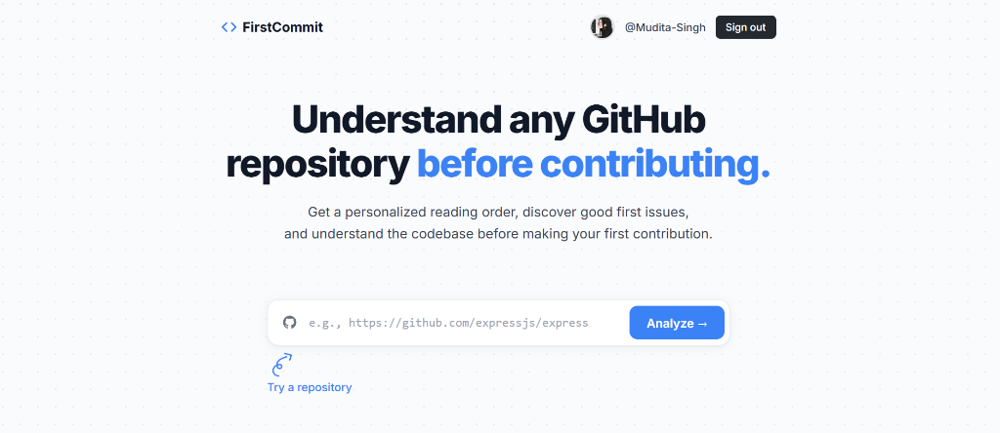

# 🚀 FirstCommit

> **Understand any GitHub repository before contributing.**

🌐 **Live Application**: [https://firstcommit-ten.vercel.app/](https://firstcommit-ten.vercel.app/)



FirstCommit is a premium developer tool designed to help first-time open-source contributors easily explore, understand, and start contributing to any public GitHub repository. By analyzing the codebase structure, generating sequential reading paths, and providing step-by-step AI implementation blueprints for issues, FirstCommit removes the initial friction of onboarding onto new codebases.

---

## ✨ Features

### 1. 📂 Codebase Reading Order & Structure Analysis
- **Codebase Indexing**: Scans repository structures (up to 150 files) to map folders, source files, configurations, and documentation.
- **AI-Guided Reading Paths**: Leverages the Google Gemini API (`gemini-2.5-flash`) to generate a sequential reading order, directing developers from high-level documentation and entry points to advanced core logic modules.
- **Language & Category Badging**: Automatically classifies codebase files with language badges and category tags (e.g., Configuration, Documentation, Source, Examples).

### 2. 🔍 Interactive Split-View Code Viewer
- **Side-by-Side Interface**: Browse codebase files side-by-side with real-time markdown-rendered explanations.
- **Line-by-Line AI Explanation**: Explains file operations, key functions, imports, and design patterns tailored specifically for newcomers.

### 3. 🎯 Intelligent Issue Explorer
- **GitHub Issues Integration**: Live-fetches active public issues directly from the repository.
- **AI-Driven Issue Blueprinting**: Generates highly targeted, actionable implementation blueprints for specific issues, explaining:
  - **Prerequisites**: Necessary concepts, tools, or libraries.
  - **Dashed Step-by-Step Timelines**: Precise checklists of files to modify, lines to add, and steps to follow.
  - **Suggested Code Snippets**: Examples of changes to make.
  - **Complexity Ratings**: Classified by confidence scores, estimated lines of code to write, and files to edit.
- **Difficulty Badging**: Automatically badges issue entry points (e.g., Beginner, Intermediate, Advanced).

### 4. 🔑 Secure GitHub OAuth Authentication
- **Secure Logins**: Fully integrated GitHub authentication using `passport-github2` strategies.
- **Session Security**: Uses JWTs (JSON Web Tokens) stored in secure `httpOnly` cookies (`fc_token`) ensuring zero exposure to client-side scripts (mitigating XSS vulnerabilities).
- **Personalized Dashboards**: Logged-in users view their profile avatars, GitHub usernames, and list of saved bookmarks.

### 5. 💾 Saved Repositories & Bookmarks
- **Repository Bookmarking**: Logged-in users can bookmark analyzed codebases directly from the workspace view.
- **Personalized Collections**: Saves up to 10 active bookmarks, displaying them as interactive, clickable cards on the personalized Home dashboard for rapid subsequent workspace loading.

### 6. ⚡ MongoDB Caching Layer
- **Persistent Cache**: Integrates with MongoDB Atlas to cache AI-generated repository summaries, file explanations, and issue blueprints.
- **High Performance**: Drastically speeds up subsequent analyses while reducing Gemini API token consumption and respecting GitHub rate limits.

---

## 🛠️ Technology Stack

| Component | Technology | Description |
| :--- | :--- | :--- |
| **Frontend** | React, Vite | Fast, responsive single-page client application. |
| **Styling** | Vanilla CSS & TailwindCSS | Modern, responsive aesthetics with premium hover interactions. |
| **Backend** | Node.js, Express | RESTful API server routing. |
| **Database** | MongoDB & Mongoose | Flexible caching schemas and User bookmark stores. |
| **AI Integration** | Google Gemini SDK | Codebase understanding via `gemini-2.5-flash`. |
| **Authentication** | Passport.js & JWT | GitHub OAuth strategy with secure cookie storage. |

---

## ⚙️ Project Structure

```bash
FirstCommit/
├── client/                 # React Frontend
│   ├── src/
│   │   ├── components/     # UI Components (IssueExplorer, Breadcrumbs, etc.)
│   │   ├── services/       # Client API layers (api.js, authApi.js)
│   │   ├── App.jsx         # Client Dashboard Hub
│   │   └── main.jsx        # App mounting entry point
│   └── package.json
├── server/                 # Express Backend
│   ├── src/
│   │   ├── middleware/     # JWT Auth guards (auth.middleware.js)
│   │   ├── models/         # MongoDB Mongoose models (User, Cache schemas)
│   │   ├── routes/         # Endpoints (auth, issue, file, repo routes)
│   │   ├── services/       # Core business logic & Gemini API wrapper
│   │   └── server.js       # App boots entry point
│   ├── .env                # Server configuration secrets
│   └── package.json
└── README.md
```

---

## 🚀 Getting Started

### 📋 Prerequisites
- **Node.js** (v18+ recommended)
- **npm** (v9+ recommended)
- **MongoDB Atlas Connection URI**
- **Google Gemini API Key**

### 🔌 Setup Environment Variables
Create a `.env` file in the `/server` directory and configure the following variables:

```env
PORT=5000
MONGODB_URI=your_mongodb_connection_uri
GEMINI_API_KEY=your_gemini_api_key
GEMINI_MODEL=gemini-2.5-flash
GITHUB_TOKEN=your_personal_github_access_token # Used to bypass GitHub API limits

# GitHub OAuth Configurations
GITHUB_CLIENT_ID=your_github_oauth_client_id
GITHUB_CLIENT_SECRET=your_github_oauth_client_secret
JWT_SECRET=your_secure_jwt_token_secret
```

### 📦 Installation
From the root workspace directory, install the required packages:

```bash
# Install root, client, and server dependencies
npm install
```

### 💻 Run Locally
Start both the backend server and Vite client concurrently in development mode:

```bash
npm run dev
```

- **Client dashboard**: `http://localhost:5173`
- **Backend API**: `http://localhost:5000`

---

## 🔄 CI/CD & Deployment Setup

FirstCommit uses **GitHub Actions** for continuous integration and automated server deployments.

### 🛠️ GitHub Actions Workflows

1. **Continuous Integration (`.github/workflows/ci.yml`)**:
   - Runs automatically on every `push` and `pull_request` targeting `main` or `dev`.
   - Utilizes a matrix strategy to lint, test, and build both `client` and `server` workspaces under Node.js 20.
   - Script steps use `--if-present` so builds succeed as tests and linters are incrementally added.

2. **Server Continuous Deployment (`.github/workflows/deploy-server.yml`)**:
   - Triggers on `push` to `main` for changes under `server/**`.
   - Sends an HTTP POST trigger to your Render / Railway deploy hook URL.
   - Executes an automated post-deploy smoke test against `/api/health` with retry backoff to verify operational status.

3. **Client Deployment (Vercel)**:
   - Client CD uses Vercel's native GitHub integration. Connected to `main`, Vercel automatically deploys preview builds on PRs and production releases on merge.

---

### 🔑 Required Secrets & Environment Configuration

Configure the following secrets in **GitHub Repository Settings -> Secrets and variables -> Actions**:

| Secret Name | Description | Environment |
| :--- | :--- | :--- |
| `RENDER_DEPLOY_HOOK_URL` | Deploy Hook URL generated in Render service settings (`Settings -> Deploy Hook`). | Production CI/CD |
| `SERVER_URL` | Base URL of the backend API (e.g. `https://firstcommit-4y9h.onrender.com`). | Production CI/CD |

#### Deployment Platform Environment Variables (Render / Railway / Vercel)
> [!TIP]
> Keep **Staging** and **Production** environments isolated by using separate MongoDB Atlas database clusters, distinct GitHub OAuth Applications, and separate Gemini API keys.

- **Server Hosting (Render/Railway)**:
  - `MONGODB_URI`: Production database connection string.
  - `GEMINI_API_KEY`: API key for Google Gemini AI service.
  - `GITHUB_CLIENT_ID` & `GITHUB_CLIENT_SECRET`: GitHub OAuth app credentials.
  - `GITHUB_CALLBACK_URL`: `https://<server-domain>/api/auth/github/callback`
  - `CLIENT_URL`: `https://firstcommit-ten.vercel.app`
  - `JWT_SECRET`: Secret string for HTTP-only JWT cookies (`fc_token`).
  - `NODE_ENV`: `production`

---

### 🌐 Cross-Origin Auth & Cookie Architecture

FirstCommit uses HTTP-only JWT cookies (`fc_token`) with Passport GitHub OAuth for secure user authentication.

> [!IMPORTANT]
> **Cross-Domain Cookie Considerations**:
> When the frontend (`https://firstcommit-ten.vercel.app`) and backend (`https://firstcommit-4y9h.onrender.com`) reside on different host domains, browsers enforce strict third-party cookie restrictions:
>
> 1. **Vercel API Rewrites (Recommended & Enabled)**:
>    FirstCommit includes a `vercel.json` rewrite configuration:
>    ```json
>    {
>      "rewrites": [
>        { "source": "/api/:path*", "destination": "https://firstcommit-4y9h.onrender.com/api/:path*" }
>      ]
>    }
>    ```
>    This proxies all frontend API calls from `/api/*` to the Render backend, keeping requests **Same-Origin** from the browser's perspective and completely eliminating 3rd-party cookie blocking.
>
> 2. **Express Proxy Trust & Cookie Flags**:
>    - In `server/src/server.js`, `app.set('trust proxy', 1)` is enabled in production so Express accurately detects HTTPS headers forwarded by Render's reverse proxy.
>    - Cookies are configured with `secure: true`, `httpOnly: true`, and `sameSite: 'none'` (or `'lax'` when proxied through Vercel).

